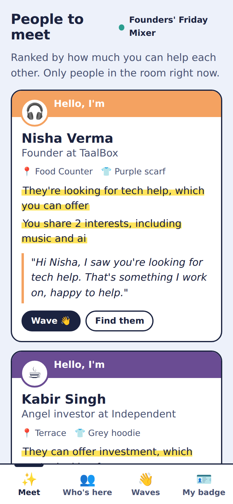
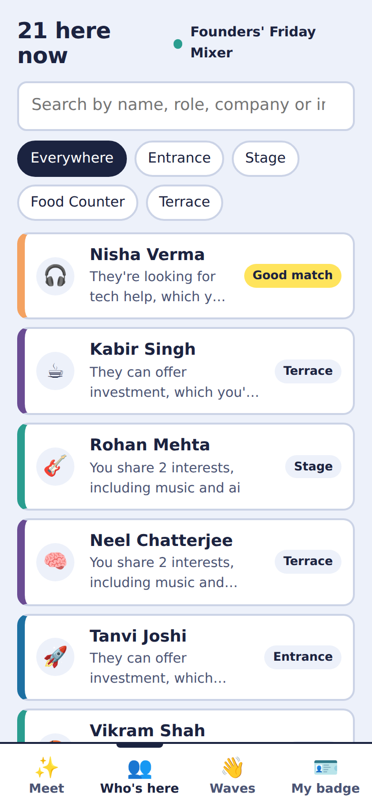
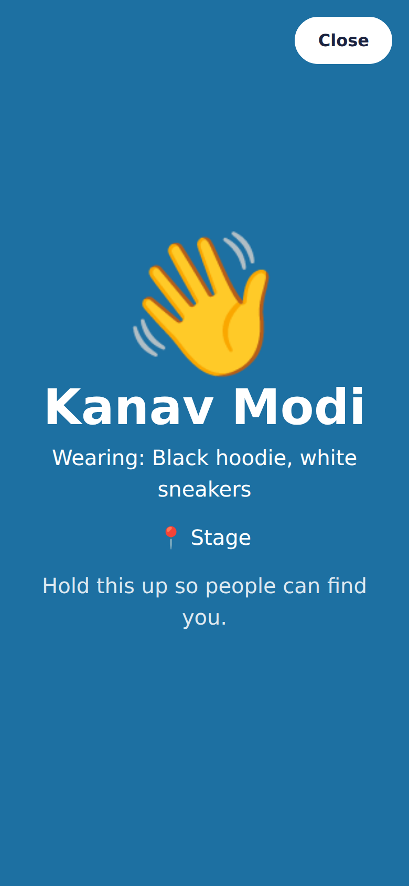
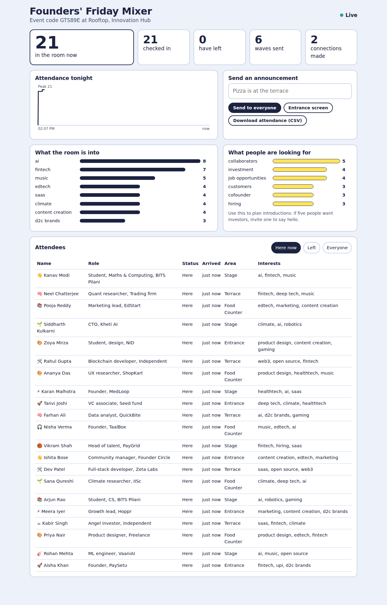
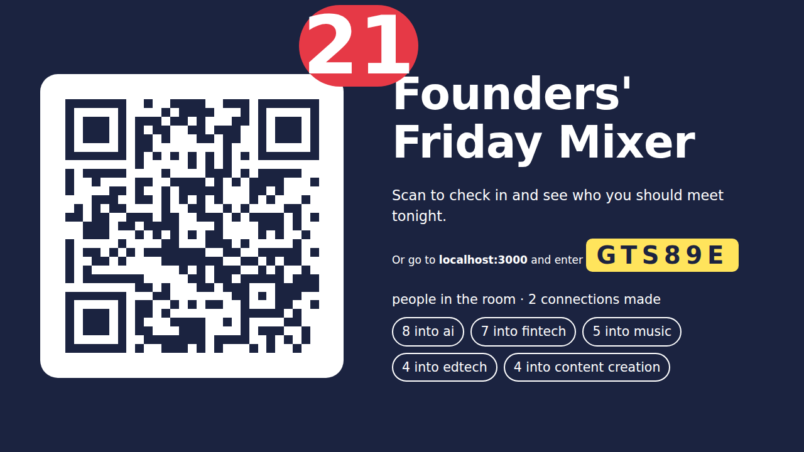
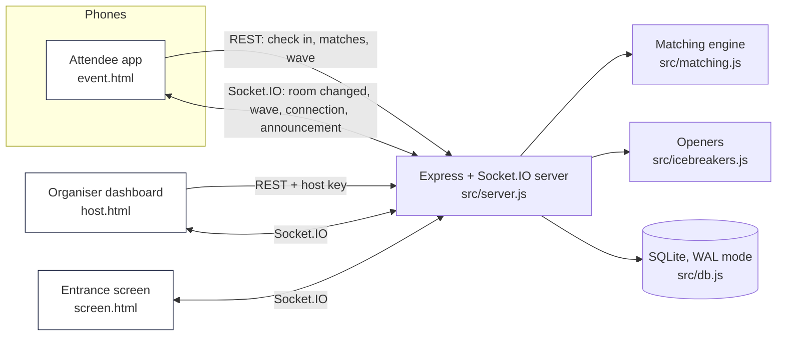

# RoomRadar

**Know who's in the room, and who to talk to first.**

At a mixer you walk up to a stranger with no idea who they are, organisers can't tell who has arrived or left, and the one person you most needed to meet leaves before you find them. RoomRadar fixes that with a QR check-in, a live list of who's here right now, ranked "people you should meet" suggestions that explain *why*, and a full-screen badge that helps you find each other across the room.

<p>
  
  
  
</p>

## How it solves the problem

| Problem | What RoomRadar does |
|---|---|
| You don't know who's at the event right now | **Live "Who's here" list** that updates in real time as people check in and leave. Search by name, role, company or interest, and filter by area of the room. |
| You don't know who's worth approaching | **"People to meet"**, ranked for you, with plain-language reasons: *"They're looking for tech help, which you can offer"*, *"You're two of only a few people here into climate"*. |
| Walking up to a stranger is awkward | Every suggestion comes with a **conversation opener** built from what you actually share. Optional AI-written openers. |
| You can't find the person in a crowded room | **"Find them"**: their badge colour, emoji, what they're wearing and which area they're in. **"My badge"** turns your phone into a full-screen name badge you can hold up. |
| Swapping contacts is clumsy, and not everyone wants to | **Wave → wave back.** A wave is a light "I'd like to talk". When both people wave, they're connected and see each other's LinkedIn or email. Nobody's contact is ever shown without a mutual wave. |
| Organisers can't track attendance | **Organiser dashboard**: live headcount, check-ins and departures, an attendance curve, what the room is into, what people are looking for, announcements to everyone's phone, and CSV export. |
| People leave without telling anyone | **Automatic check-out**: phones send a quiet heartbeat; anyone silent for 15 minutes is marked as gone, so the list stays honest. People can also tap "I'm leaving". |

**Beyond a directory:** the matching engine looks for *complementary needs* (you offer what they're looking for, and vice versa), weights shared interests by how *rare* they are in this room, and adds one **wildcard** suggestion outside your usual circle, so the app creates serendipity instead of an echo chamber.

## User flow

1. **Organiser** creates an event on the home page → gets an event code, a QR code, an entrance screen and a private dashboard link.
2. **Attendee** scans the QR at the entrance → fills a one-minute profile (name, role, interests, what they're looking for, what they can help with, what they're wearing) → checked in.
3. The attendee sees **People to meet** straight away, with reasons and an opener, and can **Wave** or **Find them**.
4. When both people wave, they're **connected** and see each other's contact under **Waves**.
5. The organiser watches the room fill up live, sends announcements ("Pizza is on the terrace"), and downloads attendance at the end.

<p>
  
  
</p>

## Quick start

Requires **Node.js 18.18 or newer**.

```bash
git clone https://github.com/<your-username>/roomradar.git
cd roomradar
npm install
npm start                 # http://localhost:3000
```

### Try it with a full room (demo mode)

```bash
# terminal 1: keep people "present" for 2 hours so the demo room doesn't empty
PRESENCE_TIMEOUT_MIN=120 npm start
# terminal 2: create a demo event with 20 attendees, waves and connections
npm run seed
```

The seed script prints three links: the check-in page (open it on your phone and check in as yourself), the organiser dashboard, and the entrance screen. Use `npm run seed -- --live` to check people in one every 2.5 seconds, which is useful for watching the dashboard update live.

**Using a phone on the same Wi-Fi:** run `npm run seed -- --url http://<your-laptop-ip>:3000` and open the printed links on the phone. Set `PUBLIC_URL=http://<your-laptop-ip>:3000` before `npm start` so the QR code points to your laptop.

### Configuration

Copy `.env.example` to `.env` (or set the variables in your shell):

| Variable | Default | Purpose |
|---|---|---|
| `PORT` | `3000` | Port to listen on |
| `DB_FILE` | `data/roomradar.db` | SQLite database file |
| `PRESENCE_TIMEOUT_MIN` | `15` | Minutes of silence before someone is marked as left |
| `PUBLIC_URL` | request host | Base URL used in QR codes and links when deployed |
| `ANTHROPIC_API_KEY` | *(unset)* | Optional. Enables AI-written conversation openers |

### Tests

```bash
npm test
```

14 tests covering the matching engine (complementary needs, rarity weighting, exclusions, wildcard, a 5,000-attendee performance check) and the full API over HTTP and WebSockets (check-in, private contacts, real-time wave notification, mutual connection, organiser auth, CSV export, automatic check-out, input validation).

## Architecture



```
roomradar/
├── src/
│   ├── server.js        # HTTP API, real-time events, automatic check-out
│   ├── db.js            # all SQL in one place (swap for Postgres by rewriting one file)
│   ├── matching.js      # pure, tested ranking engine with human-readable reasons
│   └── icebreakers.js   # openers: templates, plus optional AI with a 4-second timeout
├── public/              # no build step: plain HTML, CSS and ES modules
│   ├── index.html       # create an event / join with a code
│   ├── event.html/.js   # attendee app: check-in, Meet, Who's here, Waves, My badge
│   ├── host.html        # organiser dashboard
│   ├── screen.html      # entrance display with QR and live headcount
│   ├── common.js        # shared helpers
│   └── styles.css       # name-badge design system
├── scripts/seed-demo.js # realistic demo event through the public API
├── test/                # node:test unit + integration tests
└── docs/screenshots/
```

**Key design decisions**

- **Real time without hammering the server.** Changes are broadcast as a small "room changed" signal, debounced to at most one every 400 ms per event, and each phone refetches only the tab it's looking at. A check-in rush of 200 people produces a handful of broadcasts, not 200.
- **Privacy by default.** Other attendees see your name, role, interests and badge, never your contact. Contact details are revealed only after a mutual wave. Each phone holds a private random token; organisers use a separate secret key. The entrance screen shows only aggregate numbers.
- **Presence that stays honest.** Explicit "I'm leaving" plus a heartbeat sweep, so the list doesn't fill up with people who left an hour ago.
- **Works in the room.** Mobile-first, large tap targets, a highly legible typeface for dim venues, a bottom tab bar for one-handed use, vibration on a wave, and no app install: scan and go.

## How matching works

For each pair (you, them), `src/matching.js` computes:

| Signal | How | Weight |
|---|---|---|
| Complementary needs | What you're looking for ∩ what they offer, plus the reverse. **Bonus when both directions match.** | 3.0 each (+2.0) |
| Shared interests | Sum of IDF weights of shared interests. Rare topics in this room count more than common ones. | 1.6 |
| Similar work | TF-IDF cosine similarity of the two bios | 2.0 |
| Nudges | Different organisation (+0.4), same area of the room (+0.5). These only reorder real matches; they never create one. | small |

Every contribution also produces a sentence, so the app always explains *why* someone is suggested. A **wildcard** pick adds the person with the rarest shared interest who isn't already in your top list.

## Scalability

- **Matching cost** is O(n × k) per request (n attendees, k tags each), after a shared O(n × k) statistics pass. The test suite ranks one person against **5,000 attendees** and checks it stays fast.
- **Real-time fan-out** is per event (Socket.IO rooms), debounced, so many simultaneous events don't interfere.
- **Storage** is SQLite in WAL mode with indexes on `(event_id, status)`, which is plenty for a single server handling many events.
- **Going bigger** (conferences with tens of thousands of people): move `db.js` to Postgres, add the Socket.IO Redis adapter to run several server instances behind a load balancer, and cache the per-event room statistics for a few seconds. None of these change the API or the front end.
- **Event types:** areas of the room are configurable per event (a club night might use "Dance floor, Bar"; a career fair "Stall A–F"), and the "looking for / can help with" vocabulary covers hiring, mentoring, investing and collaborating.

## Deploying

Any Node host works (Render, Railway, Fly.io, a small VPS). Set `PUBLIC_URL` to the public address so QR codes point to it, and keep `DB_FILE` on a persistent disk.

## Built with AI tools

This project was built with an AI coding assistant (Anthropic's Claude) used as a pair programmer: to draft the matching engine and the tests that pin down its behaviour, generate the demo dataset, and review the UI through automated browser screenshots. Every piece was run, tested and adjusted by hand. For example, a test caught that people with nothing in common were being suggested only because they worked at a different company, and the scoring was changed so nudges can no longer create a match on their own. `CLAUDE_CODE_PROMPT.md` contains the prompt for continuing development with Claude Code.

## Roadmap

- Mutual-match "meet at the terrace in 5 minutes" nudges
- Organiser-curated introductions ("Introduce Aisha to Kabir")
- Import attendees from a ticketing CSV before the event
- Post-event summary email with everyone you connected with

## Licence

MIT
